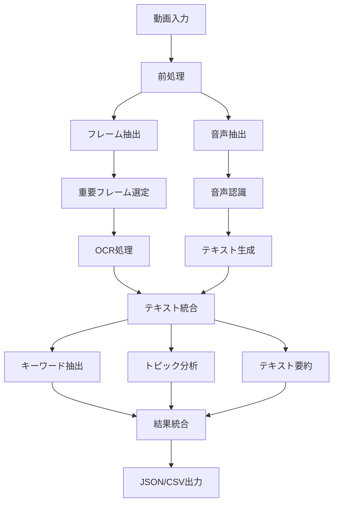
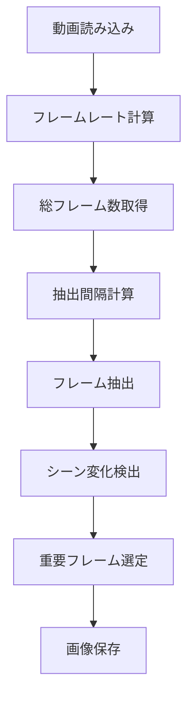
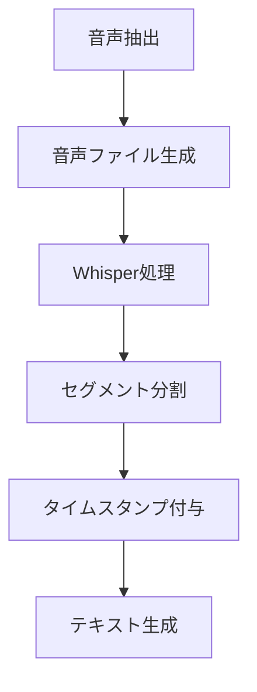
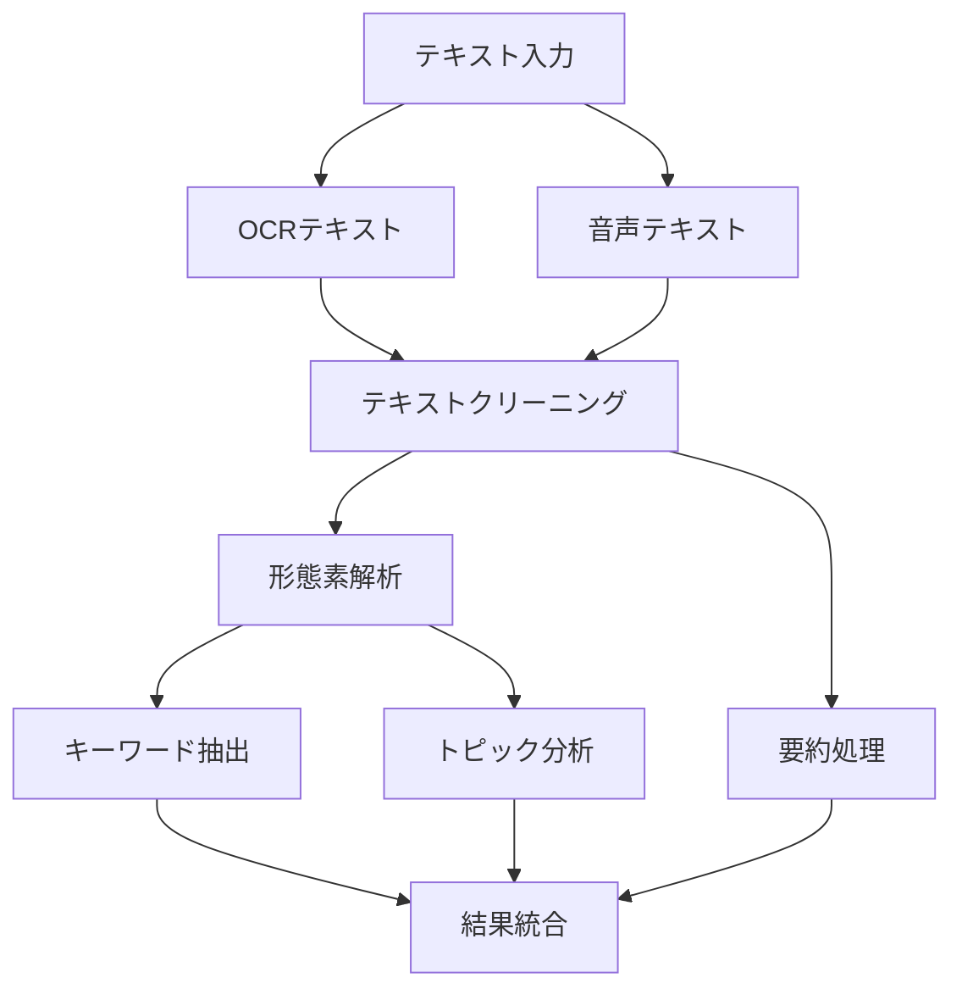

# システムフローチャート

## 1. メインフロー



## 2. フレーム抽出フロー



## 3. 音声処理フロー



## 4. テキスト処理フロー



## 5. データ構造

### 5.1 フレーム情報
```json
{
    "frame_id": "string",
    "timestamp": "float",
    "importance_score": "float",
    "ocr_text": "string",
    "image_path": "string"
}
```

### 5.2 音声セグメント
```json
{
    "segment_id": "string",
    "start_time": "float",
    "end_time": "float",
    "text": "string",
    "confidence": "float"
}
```

### 5.3 最終出力
```json
{
    "video_id": "string",
    "timestamp": "string",
    "frames": [
        {
            "timestamp": "float",
            "ocr_text": "string",
            "image_path": "string"
        }
    ],
    "transcription": [
        {
            "start": "float",
            "end": "float",
            "text": "string"
        }
    ],
    "analysis": {
        "keywords": ["string"],
        "topics": ["string"],
        "summary": "string"
    }
}
```

## 6. エラーハンドリング

```mermaid
graph TD
    A[エラー発生] --> B{エラー種別判定}
    B -->|入力エラー| C1[入力検証]
    B -->|処理エラー| C2[処理再試行]
    B -->|システムエラー| C3[システム復旧]
    
    C1 --> D[エラーログ記録]
    C2 --> D
    C3 --> D
    
    D --> E[エラーレポート生成]