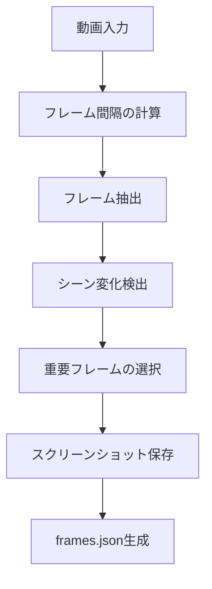
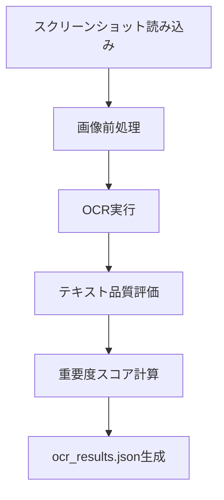
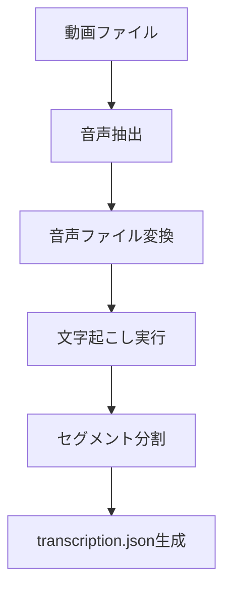
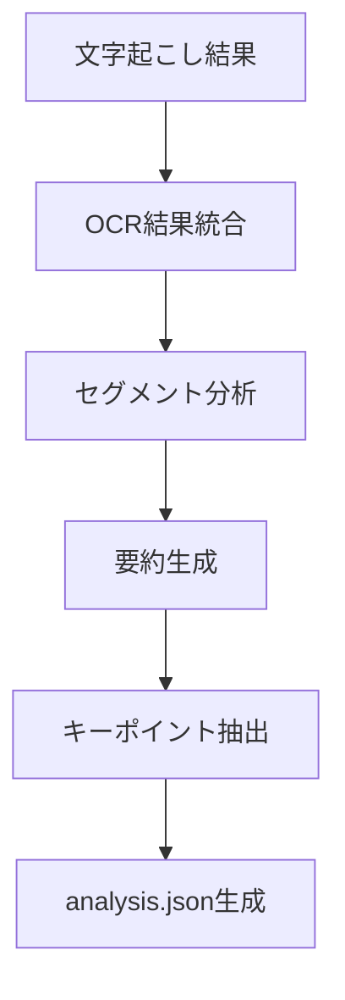
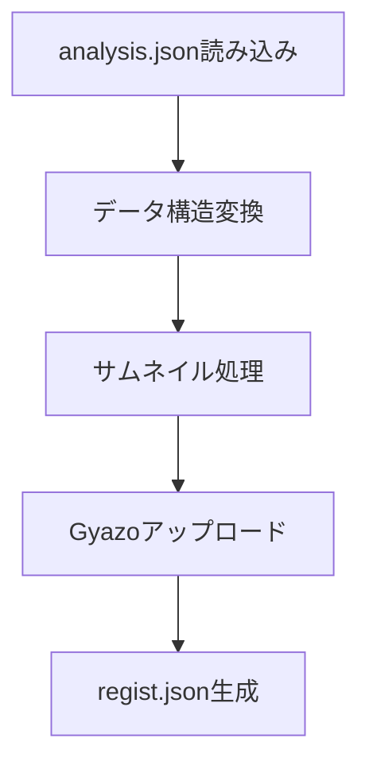

# 動画処理フロー仕様書

## 1. 概要

このドキュメントでは、動画処理システムの処理フローと各ステップの詳細について説明します。

## 2. 処理フローの概要

動画処理は以下の順序で実行されます：

1. フレーム抽出
2. OCR処理
3. 音声抽出と文字起こし
4. テキスト分析
5. 結果の統合
6. Supabase登録用データ生成

## 3. 各ステップの詳細

### 3.1 フレーム抽出



- 入力: 動画ファイル
- 出力: `frames.json`, スクリーンショット画像
- 設定:
  - フレーム間隔: 0.52秒
  - 画質: 95%
  - 重要フレーム比率: 5%
  - シーン変更閾値: 0.3

### 3.2 OCR処理



- 入力: スクリーンショット画像
- 出力: `ocr_results.json`
- 処理内容:
  - 画像の前処理（コントラスト調整、ノイズ除去）
  - テキスト抽出
  - 品質評価
  - 重要度スコアの計算

### 3.3 音声処理



- 入力: 動画ファイル
- 出力: `transcription.json`
- 設定:
  - 音声形式: WAV
  - サンプルレート: 44100Hz
  - 言語: 日本語

### 3.4 テキスト分析



- 入力: `transcription.json`, `ocr_results.json`
- 出力: `analysis.json`
- 処理内容:
  - セグメントごとの分析
  - 要約生成
  - キーポイント抽出
  - メタデータ生成

### 3.5 Supabase登録用データ生成



- 入力: `analysis.json`
- 出力: `regist.json`
- 処理内容:
  - セグメントデータの変換
  - タイムスタンプのフォーマット
  - サムネイル画像のアップロード
  - JSON形式での保存

## 4. 中間ファイルの管理

### 4.1 ディレクトリ構造

```
output/
├── temp/
│   ├── frames.json
│   ├── ocr_results.json
│   ├── transcription.json
│   └── analysis.json
├── screenshots/
│   └── frame_*.jpg
├── audio/
│   └── extracted_audio.wav
├── regist.json
└── final_result.json
```

### 4.2 ファイル再利用ポリシー

1. 中間ファイルの存在確認
2. 有効性チェック
3. 再利用または新規生成の判断
4. 処理結果の保存

## 5. エラーハンドリング

### 5.1 エラーの種類

1. ファイルアクセスエラー
2. 処理エラー
3. フォーマットエラー
4. API通信エラー

### 5.2 エラー処理方針

1. エラーの詳細なログ記録
2. 適切なエラーメッセージの生成
3. クリーンアップ処理の実行
4. 再試行可能な場合の処理再開

## 6. パフォーマンス最適化

### 6.1 最適化ポイント

1. 中間ファイルの再利用
2. メモリ使用量の制御
3. 並列処理の活用
4. ディスクI/Oの最適化

### 6.2 モニタリング項目

1. 処理時間
2. メモリ使用量
3. ディスクI/O
4. CPU使用率

## 7. セキュリティ考慮事項

1. 一時ファイルの適切な管理
2. APIキーの安全な取り扱い
3. ファイルアクセス権限の設定
4. エラーメッセージでの機密情報の非表示